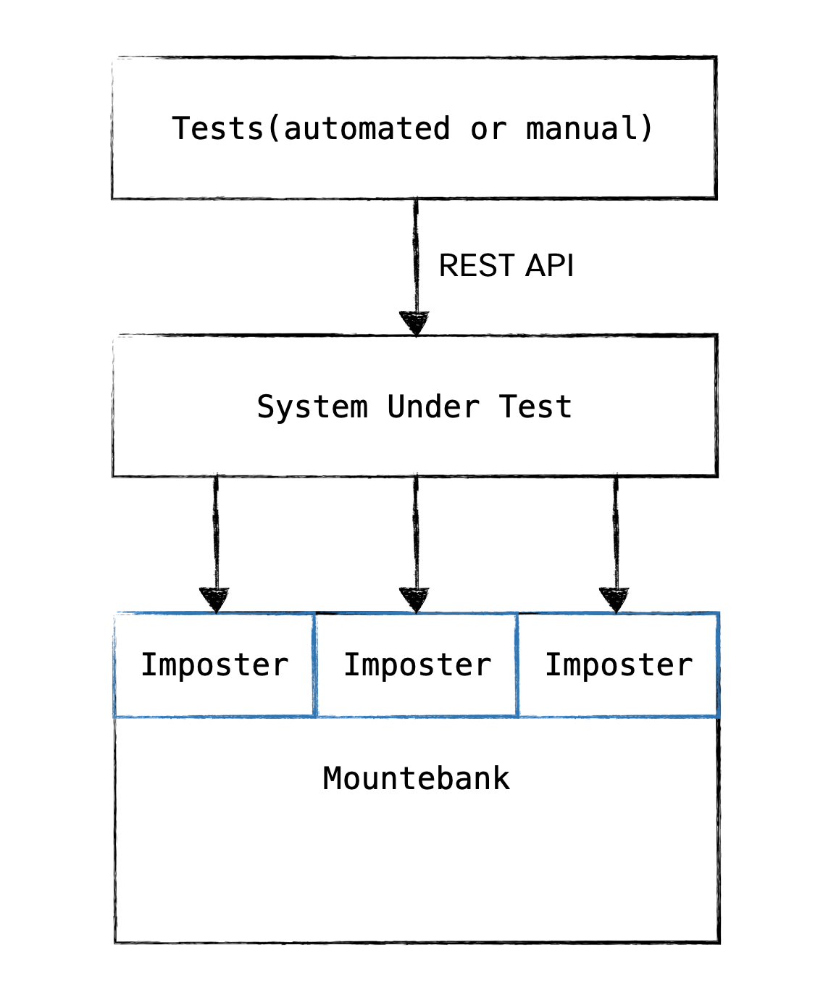

# Day 1: Hello, World! mountebank

- The Problem with End-to-End Testing
- Setting up
  - 3A pattern: Arrange, Act, Assert, Cleanup
  - Imposters: virtual services, a lightweight operation
- Hello imposter
  - Run: [Command line]
  - List imposters: [curl, web browser]
- Create imposters: [Command line], file]
- Delete the imposter: [Command line]]
- Delete all imposters
- Saving multiple Imposters in the config file
- EJS: Embedded JavaScript

## Setup Node.js(Windows)

- Goto [Node.js downloads](https://nodejs.org/en/download/) and download Node.js for Windows
  - LTS
  - Current
- Run the Node.js Installer(Windows)
  - Welcome to the Node.js setup wizard
    - Select **_Next_**
  - End-User License Agreement (EULA)
    - Check **_I accept the terms in the License Agreement_**
    - Select **_Next_**
  - Destination Folder
    - Select **_Next_**
  - Custom Setup
    - Select **_Next_**
  - Ready to install Node.js
    - Select **_Install_**
    - Note: This step requires Administrator privileges.
    - If prompted, authenticate as an Administrator.
  - Installing Node.js
    - Let the installer run to completion.
  - Completed the Node.js Setup Wizard
    - Click **_Finish_**

## Setup Node.js(Mac)

- Install Homebrew

```sh
/bin/bash -c "$(curl -fsSL https://raw.githubusercontent.com/Homebrew/install/master/install.sh)"
```

- Install Node.js

```sh
brew install node
```

## Verify That Node.js was Properly Installed and Install Mountebank

- Run command

```sh
node -v
```

- Update npm

```sh
npm install npm -g
```

- Install mountebank

```sh
npm install mountebank -g
```

## The Problem with End-to-End Testing

- Time
- Cost
- Slow feedback loop

## 3A pattern: Arrange, Act, Assert, Cleanup

- Setup data test
- Execute the system under test
- Assert the expected response
- Clean the state

## Imposters: virtual services, a lightweight operation

- Mountebank provides configure virtual services, which are called imposters.
- Each imposter represents a socket that acts as the virtual service and accepts connections from the real service you are testing.
- Spinning up and shutting down imposters is a lightweight operation.


a simple Mountebank imposter

> ref: Testing Microservice with Mountebank page 17

---

## How mountebank views an HTTP request

> ref: Testing Microservice with Mountebank page 26

```txt
POST /products?page=2&itemsPerPage=2 HTTP/1.1
Host: api.petstore.com
Content-Type: application/json

{
  "key": "asdul7890"
}
```

```json
{
  "method": "POST",
  "path": "/products",
  "query": {
    "page": 2,
    "itemsPrePage": 2
  },
  "headers": {
    "Host": "api.petstore.com",
    "Content-Type": "application/json"
  },
  "body": "{\n  \"key\": \"asdul7890\"\n}"
}
```

## How mountebank views an HTTP response

> ref: Testing Microservice with Mountebank page 27

```txt
HTTP/1.1 200 OK
Date: Sun, 05 Apr 2020 10:10:10 GMT
Content-Type: application/json

{
  "key": "asdul7890"
}
```

```json
{
  "statusCode": 200,
  "headers": {
    "Date": "Sun, 05 Apr 2020 10:10:10 GMT",
    "Content-Type": "application/json"
  },
  "body": "{\n  \"key\": \"asdul7890\"\n}"
}
```

### The HTTP response structure in JSON

```json
{
  "statusCode": 200,
  "headers": { "Content-Type": "text/plain" },
  "body": "Hello, World!"
}
```

---

## Hello, World Mountebank

### Run: [Command line]

```sh
mb
```

> open web browser then go to [http://localhost:2525](http://localhost:2525)

### List imposters: [Command line, Web browser]

> curl

```sh
curl http://localhost:2525/imposters
```

> goto [http://localhost:2525/imposters](http://localhost:2525/imposters)

### Create First Imposters: [Command line]

> curl

```sh
curl -X POST http://localhost:2525/imposters --data '
{
  "protocol": "http",
  "port": 3000,
  "stubs": [
    {
      "responses": [
        {
          "is": {
            "statusCode": 200,
            "headers": { "Content-Type": "text/plain" },
            "body": "Hello, World!"
          }
        }
      ]
    }
  ]
}'
```

### Delete: [Command line]

> curl

```sh
curl -X DELETE http://localhost:2525/imposters/3000
```

> response

```sh
info: [mb:2525] DELETE /imposters/3000
info: [http:3000] Ciao for now
```

> list imposters

```sh
curl http://localhost:2525/imposters
```

## Delete all impostes

> curl

```sh
curl -X DELETE http://localhost:2525/imposters
```

### Create First Imposters from Config File

> create file call hello-world.json

```json
{
  "protocol": "http",
  "port": 3000,
  "stubs": [
    {
      "responses": [
        {
          "is": {
            "statusCode": 200,
            "headers": { "Content-Type": "text/plain" },
            "body": "Hello, World!"
          }
        }
      ]
    }
  ]
}
```

```sh
mb start --configfile hello-world.json
```

---

## The Basic of Mountebank HTTP Responses

The **_is_** response type, which is the fundamental building block for a stub.

### The HTTP response structure in JSON

```json
{
  "statusCode": 200,
  "headers": { "Content-Type": "text/plain" },
  "body": "Hello, World!"
}
```

### Default Response

```json
{
  "protocol": "http",
  "port": 3001,
  "name": "Default Response",
  "defaultResponse": {
    "statusCode": 400,
    "headers": {
      "Connection": "Keep-Alive",
      "Content-Length": 0
    }
  },
  "stubs": [
    {
      "responses": [
        {
          "is": { "body": "BOOM!!!" }
        }
      ]
    }
  ]
}
```

### Cycling through response

```json
{
  "protocol": "http",
  "port": 3002,
  "stubs": [
    {
      "responses": [
        {
          "is": { "body": "1" }
        },
        {
          "is": { "body": "2" }
        },
        {
          "is": { "body": "3" }
        }
      ]
    }
  ]
}
```

---

## Saving multiple Imposters in the config file

```json
{
  "imposters": [
    {
      "protocol": "http",
      "port": 3000,
      "stubs": [
        {
          "responses": [
            {
              "is": {
                "statusCode": 200,
                "headers": { "Content-Type": "text/plain" },
                "body": "Hello, World!"
              }
            }
          ]
        }
      ]
    },
    {
      "protocol": "http",
      "port": 3001,
      "name": "Default Response",
      "defaultResponse": {
        "statusCode": 400,
        "headers": {
          "Connection": "Keep-Alive",
          "Content-Length": 0
        }
      },
      "stubs": [
        {
          "responses": [
            {
              "is": { "body": "BOOM!!!" }
            }
          ]
        }
      ]
    },
    {
      "protocol": "http",
      "port": 3002,
      "stubs": [
        {
          "responses": [
            { "is": { "body": "1" } },
            { "is": { "body": "2" } },
            { "is": { "body": "3" } }
          ]
        }
      ]
    }
  ]
}
```

```sh
imposter.ejs
hello-world.json
default-response.json
cycling-through-response.json
```

```json
{
  "imposters": [
    <%- include hello-world.json %>,
    <%- include default-response.json %>,
    <%- include cycling-through-response.json %>,
  ]
}
```

## EJS: Embedded JavaScript

> Mountebank uses a templating language called EJS ([https://ejs.co/](https://ejs.co/))

---

## Imposter Structure

```json
{
  "port": <port>,
  "protocol": "http",
  "stubs": [
    {
      "predicates": [],
      "responses": [
        {
          "is": {
            "statusCode": <statusCode>,
            "headers": {},
            "body": {}
          }
        }
      ]
    }
  ]
}
```

## Basic command and option

```sh
mb start --configfile hello-world.json --pidfile &
```

```sh
mb stop
```

```sh
mb restart  --configfile hello-world.json --pidfile &
```
