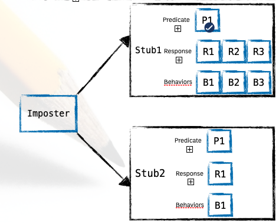

# Day 4: Adding Behaviors

## Understand behaviors

- Predicates help route requests on the way in.
- Responses generate the responses on the way out.
- **_Behaviors_** post-process the responses before shipping them over the wire



```json
{
  "protocol": "http",
  "port": 3000,
  "stubs": [
    {
      "predicates": [],
      "responses": [
        {
          "is": {},
          "_behaviors": {
            "decorate": {},
            "wait": {},
            "copy": []
          }
        }
      ]
    }
  ]
}
```

## Decorating a response

Decoration allows you to post-process the response.

### Using the decorate function

- An **_inject_** response to a **_decorate_** behavior

```json
{
  "responses": [
    {
      "inject": "function (request, state, logger) {}"
    }
  ]
}
```

```json
{
  "responses": [
    {
      "is": {
        "body": {}
      },
      "_behaviors": {
        "decorate": "function (request, response, logger) {}"
      }
    }
  ]
}
```

> file decorate.json

```sh
mb start --allowInjection --configfile decorate.json
```

```json
{
  "protocol": "http",
  "port": 3000,
  "stubs": [
    {
      "responses": [
        {
          "is": {
            "statusCode": 201,
            "headers": { "Content-Type": "application/json" },
            "body": {}
          },
          "_behaviors": {
            "decorate": "function (request, response, logger) { const item = JSON.parse(request.body); response.body.message = item.name"
          }
        }
      ]
    }
  ]
}
```

### Quiz

```json
POST /items HTTP/1.1
Host: localhost:3000

{
  "name": "RiderX",
  "price": 12.95
}
```

> response

```json
HTTP/1.1 201 OK
Content-Type: application/json

{
  "message": "RiderX is created",
  "timestamp": "Thu Apr 09 2020 00:21:32 GMT+0700 (Indochina Time)"
}
```

## Adding latency to a Response

### Using a wait behavior to add latency

> file sleep.json

```json
{
  "protocol": "http",
  "port": 3000,
  "stubs": [
    {
      "responses": [
        {
          "is": {
            "statusCode": 201,
            "headers": { "Content-Type": "application/json" },
            "body": { "name": "sleep" }
          },
          "_behaviors": {
            "wait": 3000
          }
        }
      ]
    }
  ]
}
```

## Repeating a Response Multiple Times

### Using a repeat behavior to return an error after a small number of successes

> file repeating_a_response.json

```json
{
  "protocol": "http",
  "port": 3000,
  "stubs": [
    {
      "predicates": [
        {
          "matches": { "path": "/items/1" }
        }
      ],
      "responses": [
        {
          "is": {
            "body": {
              "name": "43 Piece Dinner Set",
              "price": 12.95
            }
          },
          "_behaviors": {
            "repeat": 3
          }
        },
        {
          "is": {
            "body": {
              "name": "RiderX",
              "price": 2.95
            }
          }
        },
        {
          "is": {
            "body": {
              "name": "Alpha Bot",
              "price": 33.95
            }
          },
          "_behaviors": {
            "repeat": 5
          }
        }
      ]
    }
  ]
}
```

## Replacing Content in The Response

You can always add dynamic data to a response through an inject response, or through the decorate and shellTransform behaviors. But two additional behaviors support inserting certain types of dynamic data into the response without the overhead of programmatic control.

> page 141

### Copying Request Data to the Response

- The copy behavior accepts an array, which means you can make multiple replacements in the response.
- Each replacement should use a different token, and each one can select from a different part of the request.
- You never specify where the token is in the response. That’s by design. You could have put the token in the headers or even the status- Code, and mountebank would replace it.

> page 143

### Using a copy behavior to insert the ID from the URL into the response body

> request

```json
GET /items/1 HTTP/1.1
Host: localhost:3000

```

> response

```json
{
  "id": 1,
  "name": "43 Piece Dinner Set",
  "price": 12.95
}
```

> file replacing_content_in_the_response.json
```json
{
  "protocol": "http",
  "port": 3000,
  "stubs": [
    {
      "is": {
        "body": {
          "id": "$ID",
          "name": "43 Piece Dinner Set",
          "price": 12.95
        }
      },
      "_behaviors": {
        "copy": [
          {
            "from": "path",
            "into": "$ID",
            "using": {
              "method": "regex",
              "selector": "\\d+$"
            }
          }
        ]
      }
    }
  ]
}
```

### The regex primitives

- \d A digit, 0–9 (you have to double-escape the backslash in JSON)
- \w A word character
- \+ One or more times
- \$ The end of the string

> page 143

### Using a Group Match

```txt
items/(\\w+)

items/123

['items/123', '123']
```

> file using_a_grouped_match.json

```json
{
  "protocol": "http",
  "port": 3000,
  "stubs": [
    {
      "responses": [
        {
          "is": {
            "body": {
              "id": "$ID[1]",
              "name": "43 Piece Dinner Set",
              "price": 12.95
            }
          },
          "_behaviors": {
            "copy": [
              {
                "from": "path",
                "into": "$ID",
                "using": {
                  "method": "regex",
                  "selector": "items/(\\w+)"
                }
              }
            ]
          }
        }
      ]
    }
  ]
}
```

### Quiz

```json
POST /items HTTP/1.1
Host: localhost:3000
Content-Type: application/json

{
  "name": "RiderX",
  "price": 12.95
}
```

> response

```json
HTTP/1.1 201 OK
Content-Type: application/json

{
  "message": "RiderX is created",
  "timestamp": "Thu Apr 09 2020 00:21:32 GMT+0700 (Indochina Time)"
}
```

### Looking Up Data from an External Data Source

> file duplicate_stubs.json

```json
{
  "protocol": "http",
  "port": 3000,
  "stubs": [
    {
      "predicates": [
        {
          "equals": { "path": "/items/1" }
        }
      ],
      "responses": [
        {
          "is": {
            "statusCode": 200,
            "headers": { "Content-Type": "application/json" },
            "body": {
              "id": "1",
              "name": "43 Piece Dinner Set",
              "price": 12.95
            }
          }
        }
      ]
    },
    {
      "predicates": [
        {
          "equals": { "path": "/items/2" }
        }
      ],
      "responses": [
        {
          "is": {
            "statusCode": 200,
            "headers": { "Content-Type": "application/json" },
            "body": {
              "id": "2",
              "name": "RiderX",
              "price": 2.95
            }
          }
        }
      ]
    },
    {
      "predicates": [
        {
          "equals": { "path": "/items/3" }
        }
      ],
      "responses": [
        {
          "is": {
            "statusCode": 200,
            "headers": { "Content-Type": "application/json" },
            "body": {
              "id": "3",
              "name": "Alpha Bot",
              "price": 33.95
            }
          }
        }
      ]
    }
  ]
}
```

> file lookup.json

```json
{
  "protocol": "http",
  "port": 3000,
  "stubs": [
    {
      "responses": [
        {
          "is": {
            "statusCode": 200,
            "headers": { "Content-Type": "application/json" },
            "body": {
              "id": "${row}['id']",
              "name": "${row}['name']",
              "price": "${row}[price]"
            }
          },
          "_behaviors": {
            "lookup": [
              {
                "key": {
                  "from": "path",
                  "using": {
                    "method": "regex",
                    "selector": "items/(\\w+)"
                  }
                },
                "fromDataSource": {
                  "csv": {
                    "path": "toys.csv",
                    "keyColumn": "id"
                  }
                },
                "into": "${row}"
              }
            ]
          }
        }
      ]
    }
  ]
}
```

## Quiz

```json
POST /items
HOST localhost:3000
Content-Type: application/json

{ "reqId": 12345, "name": "43 Piece Dinner Set", "price": 12.95 }
```

```json
POST /items
HOST localhost:3000
Content-Type: application/json

{ "reqId": 78901, "name": "RiderX", "price": 2.95 }
```

```json
POST /items
HOST localhost:3000
Content-Type: application/json

{ "reqId": 90328, "name": "Alph@ Bot", "price": 33.95 }
```

```json
HTTP/1.1 201
Content-Type: application/json

{ "message": "43 Piece Dinner Set is created", "reqId": 12345 }
```

```json
HTTP/1.1 400
Content-Type: application/json

{ "message": "RiderX is already exists", "reqId": 78901 }
```

```json
HTTP/1.1 400
Content-Type: application/json

{ "message": "Alph@ Bot has invalid characters", "reqId": 90328 }
```

```

```
